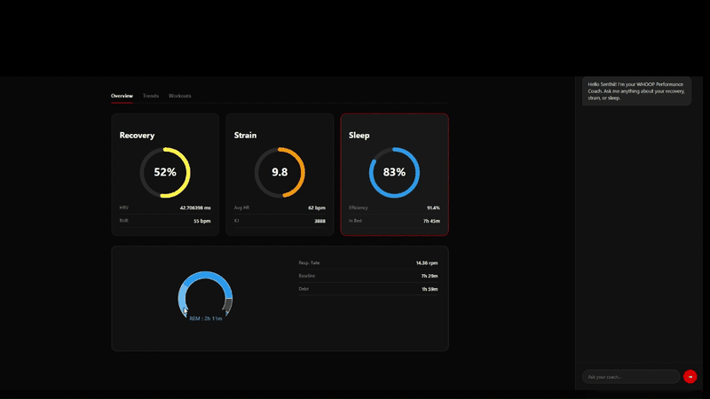

# WHOOP Intelligence Dashboard 🚀

A high-performance health intelligence application that visualizes **WHOOP API v2** data and provides an **AI Performance Coach** powered by **Google Gemini 2.0 Flash**.

### 📺 UI Preview


## 🌟 Features

- **Elite Dashboard:** Interactive cards for Recovery, Strain, and Sleep with 14-day trend visualizations.
- **AI Performance Coach:** A persistent chat panel that analyzes your physiological data to provide sports-science recommendations.
- **Detailed Insights:** Toggleable panels for deep dives into HRV, Sleep Stages, and Heart Rate metrics.
- **Secure Integration:** OAuth 2.0 flow with local token persistence.

## 🛠️ Prerequisites

Before you begin, ensure you have the following:

1.  **Node.js (v18 or higher):** [Download here](https://nodejs.org/).
2.  **WHOOP Developer Account:** Create an app at the [WHOOP Developer Portal](https://developer.whoop.com/) to get your `CLIENT_ID` and `CLIENT_SECRET`.
    - **Redirect URI:** Set this to `http://localhost:3002/callback`.
3.  **Google Gemini API Key:** Get a free API key from [Google AI Studio](https://aistudio.google.com/). (Optional)

## 🚀 Setup Instructions

### 1. Clone the Repository
```bash
git clone https://github.com/4usenthilMicrosoft/WHOOP-Intelligence-Dashboard.git
cd WHOOP-Intelligence-Dashboard
```

### 2. Install Dependencies
Install dependencies for both the backend and frontend:
```bash
# Install server dependencies
cd server
npm install

# Install client dependencies
cd ../client
npm install
```

### 3. Configure Environment Variables
Create a `.env` file in the root directory (you can copy the `.env.template` provided):

```env
WHOOP_CLIENT_ID=your_whoop_client_id
WHOOP_CLIENT_SECRET=your_whoop_client_secret
GOOGLE_GEMINI_API_KEY=your_gemini_api_key(Optional)
REDIRECT_URI=http://localhost:3002/callback
PORT=3002
COOKIE_SECRET=any_random_string
```

### 4. Run the Application
Open two terminal windows:

**Terminal 1 (Backend):**
```bash
cd server
npm run dev
```

**Terminal 2 (Frontend):**
```bash
cd client
npm run dev
```

Visit `http://localhost:5173` to view the application.

## 📈 How to Use

1.  **Login:** Click the "Login with WHOOP" button. You will be redirected to WHOOP to authorize the application.
2.  **Overview:** View your current Recovery, Strain, and Sleep scores on the main dashboard.
3.  **Insights:** Click on any card (Recovery, Strain, or Sleep) to see detailed trend charts and secondary metrics.
4.  **AI Coach:** Type questions into the chat panel on the right (e.g., "How can I improve my recovery tonight?" or "Analyze my strain trends for the last week").
5.  **Trends:** Use the "Trends" and "Workouts" tabs to switch between different data visualizations.

## 🛡️ Security Note
This project uses `.gitignore` to ensure that your sensitive `.env` file is **never** committed to GitHub. Always keep your API keys private.

---
Developed by [Senthil Kumar](https://github.com/4usenthilMicrosoft)
